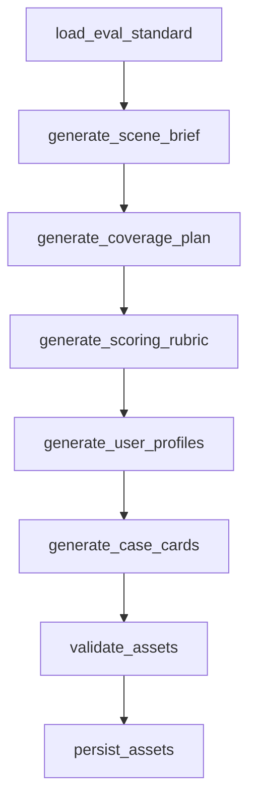
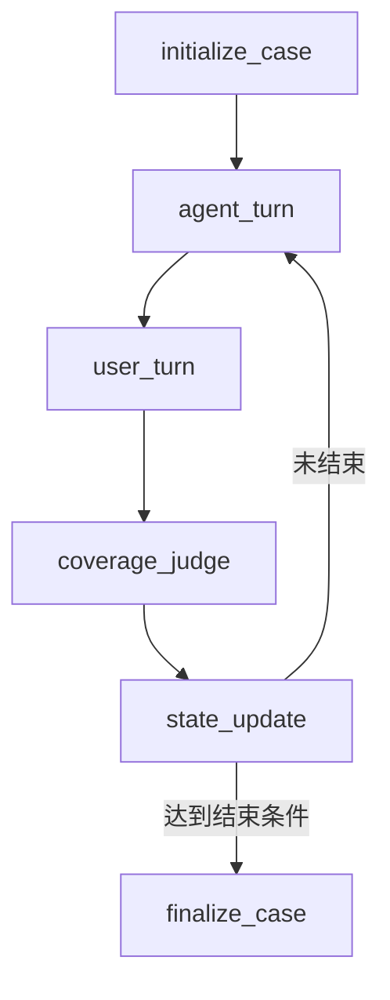

# DialogueEval 技术文档

更新时间：2026-05-16

## 1. 项目定位

DialogueEval 是一套面向履约数字人外呼场景的自动化指令遵循评估系统。它的目标不是简单生成几段模拟对话，而是围绕一份外呼任务指令，自动生成可审计的测试资产，驱动 AI 客服模型和 AI 用户模型进行多轮对话，并输出可解释、可量化的评测报告。

当前系统重点解决三个问题：

- 将 Markdown、CSV、Excel 中的任务指令转成可执行的测试资产。
- 构建用户模拟器，用不同用户画像和 case 充分测试对话模型在特定任务指令下的表现。
- 自动产出 case 子报告、总报告、覆盖结果、评分结果和模型调用 trace。

当前项目状态更接近中期可展示版本：核心链路已经打通，工程形态已经具备 WebUI、API、Docker Compose 和 Phoenix Trace，但评测可信度还需要通过人工标注集、稳定性实验和 judge 校准进一步验证。

## 2. 交付目标对应关系

| 赛题目标 | 当前实现 | 当前成熟度 |
|---|---|---:|
| 构建用户模拟器，充分测试对话模型效果 | 已实现 AI 用户画像、case card、用户模型、客服模型、coverage judge 的多轮对话流程 | 中等 |
| 自动产出评测报告 | 已输出总报告、case 子报告、CSV、JSONL、原始对话、维度评分、风险扣分、一票否决 | 中等 |
| 评测过程可解释 | 有对话记录、覆盖证据、评分理由、Phoenix trace、LLM 调用摘要 | 中等 |
| 评测结果可量化 | 有总分、维度分、通过率、风险扣分、覆盖率 | 中等 |
| 评估结果可靠 | 当前还缺人工 gold set、judge 一致性校准、重复运行稳定性验证 | 待加强 |

## 3. 技术栈

| 层级 | 技术 | 用途 |
|---|---|---|
| 核心语言 | Python | 资产生成、对话仿真、评分、报告、API 服务 |
| 后端服务 | FastAPI + Uvicorn | 对外提供文件上传、资产生成、运行评测、报告读取等接口 |
| 工作流编排 | LangGraph | 编排资产生成流程和客服/用户多轮对话流程 |
| 模型调用 | OpenAI Python SDK 兼容接口 | 当前接 DeepSeek OpenAI 兼容 API |
| 数据校验 | Pydantic v2 | 约束 LLM 结构化输出 schema |
| 配置与资产格式 | YAML / JSONL / CSV / Markdown | 场景资产、运行日志、报告和配置落盘 |
| 表格解析 | openpyxl / csv | 从 Excel、CSV 中抽取任务指令 Markdown |
| 前端 | Next.js 14 + React + TypeScript | WebUI 展示与操作入口 |
| 图标 | lucide-react | 前端导航和操作图标 |
| 可观测性 | Arize Phoenix + OpenTelemetry/OpenInference | trace、LLM 调用链、prompt 管理 |
| 持久化 | SQLite + PostgreSQL | DialogueEval 业务实验注册表使用 SQLite；Phoenix 使用 PostgreSQL |
| 部署 | Docker Compose | 一键启动 Postgres、Phoenix、API、WebUI |

## 4. 总体架构

```text
用户上传 Markdown / CSV / Excel
        |
        v
Next.js WebUI
        |
        v
FastAPI API
        |
        +--> 任务指令抽取与去重
        |
        +--> AssetGenerationGraph
        |       +--> scene_asset.yaml
        |       +--> coverage_plan.yaml
        |       +--> user_profiles.yaml
        |       +--> case_cards.yaml
        |       +--> scoring_rubric.yaml
        |
        +--> ConversationGraph
        |       +--> 客服模型生成一句
        |       +--> 用户模型基于历史回复一句
        |       +--> judge 判断覆盖与风险
        |       +--> 状态更新并进入下一轮
        |
        +--> Evaluator
        |       +--> 单 case 维度评分
        |       +--> 风险扣分
        |       +--> 一票否决
        |
        +--> Report Exporter
        |       +--> conversation_log.jsonl
        |       +--> coverage_report.csv
        |       +--> case_evaluation.jsonl
        |       +--> evaluation_report.md
        |       +--> case_reports/*.md
        |
        +--> Registry SQLite
        |
        +--> Phoenix Trace / Prompts
```

核心代码分层：

```text
dialogue_simulator/       核心组件
apps/api/                 FastAPI 后端
apps/web/                 Next.js 前端
configs/                  模型配置、生成策略、业务配置
Resource/                 示例任务和评测标准
outputs/                  资产、运行结果、报告、注册表
docker/                   Docker 初始化脚本
docs/                     辅助说明文档
tests/                    单元与结构测试
```

## 5. 核心设计原则

### 5.1 不硬编码业务场景

当前实现刻意避免在 Python 代码中写死客服话术、用户话术、用户画像、case 或特定场景分支。系统要求：

- 用户画像由 LLM 从任务指令生成。
- 场景卡片由 LLM 从任务指令生成。
- 覆盖目标由 LLM 从任务指令生成。
- 客服每轮回复由客服模型根据运行上下文生成。
- 用户每轮回复由用户模型根据用户画像、隐藏状态和历史生成。
- 覆盖判定和评分由 judge/evaluator 模型基于结构化 schema 输出。

代码只维护流程、schema、文件结构和校验规则。

### 5.2 资产可审计

资产生成不是只存在内存里，而是落盘成 YAML/Markdown：

```text
outputs/assets/{scene_id}/
  scene_asset.yaml
  coverage_plan.yaml
  user_profiles.yaml
  case_cards.yaml
  scoring_rubric.yaml
  materialized_eval_standard.md
  variable_assignments.yaml
  asset_generation_report.md
  llm_calls.jsonl
```

这些文件可以被人工检查，也可以复用到后续运行中。

### 5.3 对话和评测分离

系统把“生成对话”和“评价对话”拆成不同角色：

- `agent`：客服模型，负责根据任务推进对话。
- `user`：用户模型，负责模拟真实用户反馈。
- `judge`：覆盖判定模型，负责判断当前对话覆盖了哪些目标。
- `evaluator`：评分模型，负责对完整 case 做量化评分。

这样可以减少单一模型既生成又自评带来的耦合。

## 6. 输入处理设计

系统支持三类输入：

| 输入类型 | 处理方式 |
|---|---|
| Markdown | 直接作为一条任务指令 |
| Excel | 默认抽取第 2 列、第 2 行之后的 Markdown |
| CSV | 默认抽取第 2 列、第 2 行之后的 Markdown |

实现位置：

- `dialogue_simulator/eval_standard_loader.py`
- `apps/api/service.py`
- `dialogue_simulator/cli.py`

WebUI 层只要求用户上传文件，不要求用户选择 Markdown、CSV 或 Excel 类型。后端根据文件后缀自动判断。

系统还支持变量实例化。例如任务模板里的 `X 单 Y 天`、`Z.W 多日` 这类占位符，会先通过 `materialize_eval_standard` 节点让 LLM 替换成具体数值，避免客服或用户模型在对话中看到不可理解的占位符。

变量实例化产物：

```text
materialized_eval_standard.md
variable_assignments.yaml
```

## 7. 资产生成流程

资产生成入口：

- API：`POST /assets/generate`
- CLI：`python -m dialogue_simulator.cli generate-assets`
- 核心函数：`build_asset_generation_graph`
- 实现文件：`dialogue_simulator/graph.py`

流程：



节点职责：

| 节点 | 作用 |
|---|---|
| `load_eval_standard` | 读取任务指令、业务配置、生成策略，计算 input hash |
| `generate_scene_brief` | 生成场景资产，包括业务目标、客服角色、知识点、合规规则 |
| `generate_coverage_plan` | 生成覆盖计划，定义任务目标、证据要求、优先级 |
| `generate_scoring_rubric` | 生成评分量表，包括维度、权重、合格线、扣分、一票否决 |
| `generate_user_profiles` | 生成用户画像集合 |
| `generate_case_cards` | 生成测试 case，绑定用户画像和覆盖目标 |
| `validate_assets` | 使用 Pydantic 校验所有资产结构 |
| `persist_assets` | 将资产写入 `outputs/assets/{scene_id}` |

同一份任务指令会按输入内容 hash 复用已有资产目录，避免重复生成多个实际相同的场景资产。

## 8. 用户模拟器与对话流程

对话运行入口：

- API：`POST /runs`
- CLI：`python -m dialogue_simulator.cli run`
- 核心函数：`build_conversation_graph`
- 实现文件：`dialogue_simulator/graph.py`

单个 case 的运行流程：



关键点：

- 客服模型和用户模型是两个独立角色。
- 客服先基于场景资产、case 目标、业务配置、历史对话生成一句。
- 用户模型读取同一个 history，并基于用户画像、隐藏状态、客服上一句生成一句。
- judge 读取完整 history，判断哪些 coverage target 已被触发、是否存在风险。
- state updater 更新情绪、耐心、意愿、已触发目标、风险项、结束条件。
- 未达到结束条件时，下一轮客服继续读取同一个 history 生成下一句。

也就是：

```text
客服模型生成一句
→ 写入 history
→ 用户模型读取 history 生成一句
→ 写入 history
→ judge 读取 history 判覆盖
→ 更新状态
→ 下一轮客服继续读取同一个 history
```

这保证系统不是让单个模型一次性生成完整剧本，而是按轮次驱动两个角色对话。

## 9. 运行时上下文压缩

为了避免每次 LLM 调用都塞入过多原始内容，系统增加了 `runtime_context`：

实现位置：

- `dialogue_simulator/runtime_context.py`

设计思路：

- 客服模型只拿和客服决策相关的信息：任务目标、知识点、合规规则、case 目标、已触发目标、剩余目标、最近历史。
- 用户模型只拿用户相关的信息：用户画像、隐藏用户状态、行为策略、当前状态、客服上一句、最近历史。
- judge 只拿覆盖目标定义、历史和已触发目标。
- evaluator 拿完整评分量表、原始任务标准、完整对话结果。

这样做的目的：

- 降低 prompt 噪音。
- 减少模型调用 token。
- 降低不同角色看到不该看的信息的概率。
- 让 Phoenix trace 中的输入更可读。

## 10. 评分与报告设计

评分入口：

- 运行时自动评分：`POST /runs`
- 对已有运行补评分：`POST /runs/evaluate`
- 核心实现：`dialogue_simulator/evaluator.py`
- 报告导出：`dialogue_simulator/report_exporter.py`

评分流程：

```text
conversation_result
→ evaluator LLM 根据 scoring_rubric 生成 CaseEvaluationDraft
→ aggregate_case_evaluation 归一化分数、扣除风险分、判断一票否决
→ 输出 CaseEvaluationResult
→ 导出总报告和 case 子报告
```

评分结果包括：

- 维度得分
- 维度权重
- 缺失点
- 证据引用
- 风险扣分
- 一票否决
- 总分
- 合格线
- 是否通过

运行产物：

```text
outputs/runs/{run_id}/
  conversation_log.jsonl
  coverage_report.csv
  summary_report.md
  case_evaluation.jsonl
  evaluation_report.csv
  evaluation_report.md
  case_reports/{case_id}.md
  llm_calls.jsonl
```

其中：

- `conversation_log.jsonl` 保存每个 case 的完整对话、覆盖目标、风险项。
- `coverage_report.csv` 保存覆盖率汇总。
- `evaluation_report.md` 是总报告。
- `case_reports/*.md` 是每个 case 的子报告，包含原始对话记录和评分解释。
- `llm_calls.jsonl` 保存模型名、role、task、token、耗时、hash、错误信息等调用元数据。

## 11. Prompt 管理

本地默认 prompt 定义在：

- `dialogue_simulator/prompt_registry.py`
- `dialogue_simulator/prompt_templates.py`

系统支持将 prompt 同步到 Phoenix Prompts：

- API：`POST /prompts/sync`
- CLI：`python -m dialogue_simulator.cli sync-prompts`
- 实现：`dialogue_simulator/prompt_store.py`

运行时 prompt 读取策略：

```text
如果 DIALOGUE_EVAL_PROMPTS_PROVIDER=phoenix
    优先从 Phoenix 拉取 prompt 最新版本
否则
    使用代码内置 prompt
```

如果 Phoenix 不可用，默认回退本地 prompt。若设置 `DIALOGUE_EVAL_PROMPTS_STRICT=true`，则缺失或拉取失败时直接报错。

当前同步的主要 prompt：

```text
dialogue-eval-system-json-only
dialogue-eval-materialize-eval-standard
dialogue-eval-scene-asset
dialogue-eval-coverage-plan
dialogue-eval-user-profiles
dialogue-eval-case-cards
dialogue-eval-scoring-rubric
dialogue-eval-agent-turn
dialogue-eval-user-turn
dialogue-eval-coverage-judge
dialogue-eval-case-evaluation
```

## 12. 可观测性与 Trace

Trace 实现：

- `dialogue_simulator/tracing.py`
- Phoenix OTEL：`arize-phoenix-otel`

Docker Compose 默认开启：

```text
DIALOGUE_EVAL_TRACING_ENABLED=true
PHOENIX_COLLECTOR_ENDPOINT=http://phoenix:6006/v1/traces
PHOENIX_PROJECT_NAME=dialogue-eval
```

Phoenix 中可看到：

- `api.generate_assets`
- `asset.*`
- `api.run_evaluation`
- `case.run`
- `conversation.agent_turn`
- `conversation.user_turn`
- `conversation.coverage_judge`
- `conversation.state_update`
- `case.evaluate`
- `llm.*`

LLM trace 默认采用摘要模式：

```text
DIALOGUE_EVAL_TRACE_LLM_MESSAGES=summary
```

摘要模式会记录 role、字符数、prompt hash、短预览，避免 Phoenix 页面中出现大段 prompt。真实模型调用不受影响。

## 13. 实验注册表

Phoenix 负责 trace 和 prompt 管理，DialogueEval 自己维护业务实验注册表：

- 默认路径：`outputs/dialogue_eval_registry.sqlite3`
- 实现：`dialogue_simulator/registry.py`

核心表：

| 表 | 含义 |
|---|---|
| `datasets` | 上传或引用的 Markdown、CSV、Excel 输入 |
| `task_instructions` | 每条 Markdown 任务指令，按内容 hash 去重 |
| `asset_versions` | 一次资产版本，绑定 scene、case 数、覆盖项数、资产 hash |
| `experiments` | 一次评测运行 |
| `case_runs` | 单 case 的对话和评分摘要 |
| `llm_calls` | 每次模型调用摘要、token、hash、成功/失败信息 |

API 启动时会调用 `index_existing_outputs()`，把历史 `outputs/assets` 和 `outputs/runs` 回填到 registry 中。

## 14. FastAPI 后端

入口：

- `apps/api/main.py`
- `apps/api/service.py`

主要接口：

| 方法 | 路径 | 用途 |
|---|---|---|
| `GET` | `/health` | 查看系统状态、registry、tracing |
| `POST` | `/files/upload` | 上传 Markdown、CSV、Excel |
| `POST` | `/eval-standards/extract` | 从 Excel/CSV 抽取 Markdown |
| `POST` | `/assets/generate` | 生成场景资产 |
| `GET` | `/assets` | 列出资产 |
| `GET` | `/assets/{scene_id}/files/{filename}` | 读取资产文件 |
| `POST` | `/runs` | 运行评测 |
| `GET` | `/runs` | 列出运行记录 |
| `GET` | `/runs/{run_id}/reports/{filename}` | 读取总报告和原始文件 |
| `GET` | `/runs/{run_id}/case_reports` | 列出 case 子报告 |
| `GET` | `/runs/{run_id}/case_reports/{case_id}` | 读取 case 子报告 |
| `POST` | `/runs/evaluate` | 对已有运行补评分 |
| `GET` | `/registry/status` | 查看 registry 统计 |
| `GET` | `/registry/datasets` | 查看 datasets |
| `GET` | `/registry/experiments` | 查看 experiments |
| `POST` | `/registry/index-existing` | 手动回填 outputs |
| `GET` | `/prompts/status` | 查看 prompt 配置 |
| `POST` | `/prompts/sync` | 同步默认 prompt 到 Phoenix |

## 15. Next.js WebUI

入口：

- `apps/web/app/page.tsx`
- `apps/web/app/globals.css`
- `apps/web/app/api/backend/[...path]/route.ts`

前端通过 Next.js API route 将 `/api/backend/*` 代理到 FastAPI，避免浏览器直接处理跨容器地址。

当前页面：

| 页面 | 功能 |
|---|---|
| 工作台 | 总览服务状态、资产数、运行记录、最近平均分、通过率、实验数 |
| 新建评测 | 上传任务指令文件，生成资产，选择资产运行评测 |
| 报告中心 | 查看总报告、case 子报告、原始对话、评分、模型调用 |
| 场景资产 | 查看 scene_asset、coverage_plan、user_profiles、case_cards、scoring_rubric 等文件 |
| 实验库 | 查看 registry 中 datasets 和 experiments，支持扫描已有 outputs |
| 系统设置 | 查看 health、prompt 状态，触发 prompt 同步 |

UI 细节：

- 左侧侧边栏支持收缩。
- 数据自动后台同步，首次加载、定时、窗口聚焦和页面回到前台时都会刷新。
- WebUI 品牌标识在 `apps/web/public/logo-mark.svg` 和 `apps/web/public/logo.svg`。

## 16. Docker Compose 部署

启动命令：

```bash
docker compose up --build
```

服务：

| 服务 | 端口 | 用途 |
|---|---:|---|
| `postgres` | `5432` | Phoenix 持久化数据库 |
| `phoenix` | `6006`, `4317` | Trace UI、Prompt 管理、OTEL collector |
| `api` | `8000` | DialogueEval FastAPI |
| `web` | `8501` | Next.js WebUI，容器内端口 3000 |

访问地址：

```text
WebUI:   http://127.0.0.1:8501
API:     http://127.0.0.1:8000/docs
Phoenix: http://127.0.0.1:6006
```

关键环境变量：

| 变量 | 用途 |
|---|---|
| `DEEPSEEK_API_KEY` | DeepSeek API Key |
| `DIALOGUE_EVAL_TRACING_ENABLED` | 是否开启 trace |
| `PHOENIX_COLLECTOR_ENDPOINT` | Trace 上报地址 |
| `PHOENIX_BASE_URL` | Prompt 管理 API 地址 |
| `DIALOGUE_EVAL_PROMPTS_PROVIDER` | prompt 来源，默认 phoenix |
| `DIALOGUE_EVAL_TRACE_LLM_MESSAGES` | LLM trace 内容模式 |
| `DIALOGUE_EVAL_REGISTRY_PATH` | SQLite registry 路径 |

## 17. 当前能力边界

当前系统已经具备完整链路，但还不能简单宣称“评测结果完全可靠”。主要边界如下。

### 17.1 用户模拟器有效性还需要证明

系统可以生成用户画像和 case，但还缺少量化指标证明这些 case 已经充分覆盖：

- 正常流程
- 异常分支
- 用户拒绝
- 用户误解
- 用户追问
- 用户诱导违规
- 边界条件

后续应增加 case 覆盖率验收和人工抽样评审。

### 17.2 LLM judge 需要校准

当前 coverage judge 和 evaluator 都是 LLM。它们能产出结构化结果，但还缺：

- 人工标注 gold set
- judge 与人工一致率
- 多次重复运行稳定性
- 多 judge 交叉验证
- 低置信度样本人工复核机制

### 17.3 资产生成质量需要验收机制

资产由 LLM 从任务指令生成，方向是对的，但需要检查：

- coverage plan 是否遗漏关键任务目标。
- scoring rubric 是否忠实保留原始权重。
- user profiles 是否足够多样。
- case cards 是否覆盖 P0/P1/P2。
- 变量实例化是否改变了原始任务意图。

### 17.4 WebUI 仍是中期展示形态

当前 WebUI 已经比命令行更适合演示，但仍不是最终产品：

- 运行评测目前更偏同步执行，长任务体验还可以改成任务队列。
- 资产、运行、报告的搜索和筛选能力还弱。
- 多用户权限、项目空间、审计日志还没有实现。
- 大规模批量评测时需要后台 worker 和进度流式展示。

### 17.5 成本与性能还需治理

当前每个 case 会调用 agent、user、judge、evaluator 多个模型角色。批量任务会产生明显 token 成本。后续需要：

- 缓存资产生成结果。
- 控制 history 窗口。
- 做 prompt 压缩。
- 统计 token 成本。
- 支持并发和限流。
- 支持失败重试和断点续跑。

## 18. 如何验证系统能力

为了判断系统是否真的有评测价值，建议做以下验证实验。

### 18.1 资产质量人工抽查

对每条任务指令检查：

- `scene_asset.yaml` 是否准确总结业务目标。
- `coverage_plan.yaml` 是否覆盖所有关键任务要求。
- `scoring_rubric.yaml` 是否正确保留权重、合格线、一票否决。
- `case_cards.yaml` 是否包含多样用户和边界 case。

### 18.2 好坏模型区分实验

构造两类客服模型：

- 强模型：完整遵循任务指令。
- 弱模型：故意漏流程、乱承诺、忽略用户问题或不处理异议。

如果系统有效，报告分数应能稳定区分两者。

### 18.3 人工一致性验证

抽样 20 到 50 个 case，让人工评审标注：

- 是否完成任务。
- 是否违反合规规则。
- 缺失了哪些关键流程。
- 应得分数区间。

然后比较系统 judge/evaluator 与人工结果的一致性。

关键指标：

| 指标 | 含义 |
|---|---|
| 覆盖目标召回率 | 系统是否识别出人工认为已覆盖的目标 |
| 缺失目标准确率 | 系统标记的 missing target 是否真实缺失 |
| 风险识别准确率 | 风险项和一票否决是否准确 |
| 评分一致率 | 总分和人工分数区间是否一致 |
| 重复运行波动 | 同一任务重复运行的分数稳定性 |

## 19. 后续迭代建议

### 第一阶段：让评测结果更可信

- 建立人工 gold set。
- 增加 judge 校准集。
- 增加重复运行稳定性测试。
- 报告中强化“任务要求 -> 对话证据 -> 扣分理由”的链路。
- 对资产生成结果增加自动验收报告。

### 第二阶段：增强用户模拟器

- 增加用户行为类型库：打断、误解、沉默、拒绝、质疑、诱导违规。
- 为每个任务自动生成正常 case、边界 case、风险 case、失败诱导 case。
- 让用户模型不只配合完成任务，而是主动测试客服模型是否漏流程或越权承诺。

### 第三阶段：产品化与规模化

- 引入任务队列和后台 worker。
- 支持批量 CSV 全量评测。
- 支持运行进度、失败重试、断点续跑。
- 支持项目空间、权限、历史对比。
- 支持模型版本、prompt 版本、资产版本的实验对比。

## 20. 关键文件索引

| 文件 | 说明 |
|---|---|
| `dialogue_simulator/graph.py` | LangGraph 资产生成流程和对话流程 |
| `dialogue_simulator/asset_generator.py` | 场景资产、覆盖计划、用户画像、case、评分规则生成 |
| `dialogue_simulator/agent_model.py` | 客服模型单轮生成 |
| `dialogue_simulator/user_model.py` | 用户模型单轮生成 |
| `dialogue_simulator/coverage_judge.py` | 覆盖判定 |
| `dialogue_simulator/evaluator.py` | case 评分聚合 |
| `dialogue_simulator/report_exporter.py` | 报告导出 |
| `dialogue_simulator/runtime_context.py` | 运行时上下文裁剪 |
| `dialogue_simulator/llm_client.py` | DeepSeek/OpenAI 兼容调用和 LLM 元数据记录 |
| `dialogue_simulator/prompt_registry.py` | 默认 prompt 定义 |
| `dialogue_simulator/prompt_store.py` | Phoenix prompt 同步和读取 |
| `dialogue_simulator/registry.py` | SQLite 实验注册表 |
| `dialogue_simulator/tracing.py` | Phoenix trace 封装 |
| `dialogue_simulator/eval_standard_loader.py` | Excel/CSV/Markdown 任务指令抽取 |
| `apps/api/main.py` | FastAPI 路由 |
| `apps/api/service.py` | API 业务编排 |
| `apps/web/app/page.tsx` | Next.js WebUI 主页面 |
| `apps/web/app/api/backend/[...path]/route.ts` | WebUI 到 FastAPI 的代理 |
| `docker-compose.yml` | Postgres、Phoenix、API、WebUI 一键部署 |
| `configs/model_config.yaml` | 模型角色配置 |
| `configs/generation_policy.yaml` | 资产生成策略 |
| `configs/business_config.example.yaml` | 示例业务配置 |

