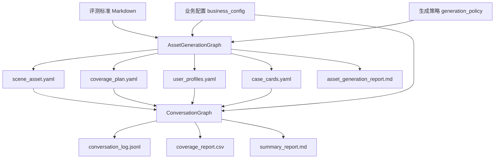
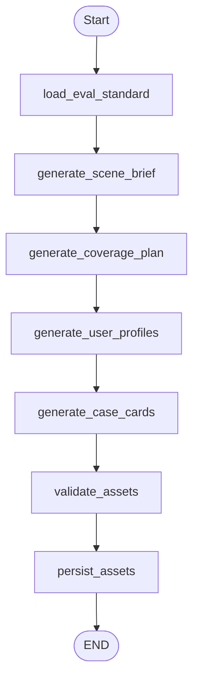
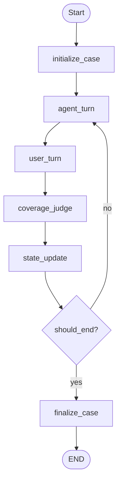
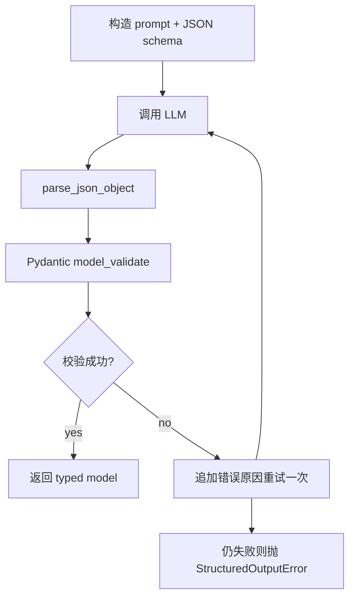
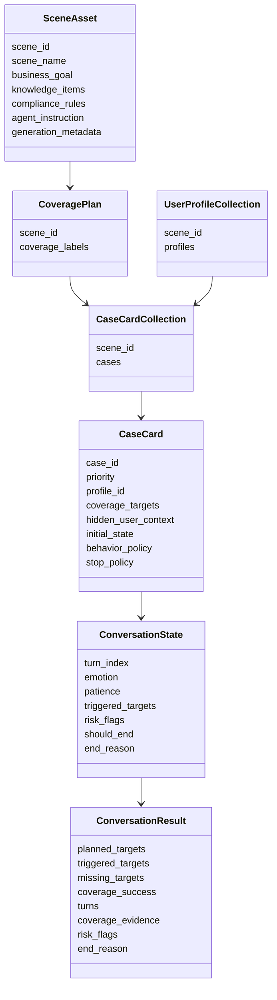

# LangGraph 流程说明

本文说明当前 `dialogue_simulator` 组件里的两条 LangGraph 流程：

1. `AssetGenerationGraph`：把评测标准 Markdown 转成可审计的场景资产。
2. `ConversationGraph`：加载场景资产，让 AI 客服和 AI 用户自动对话，并输出覆盖报告。

对应实现入口在 `dialogue_simulator/graph.py`：

- `build_asset_generation_graph(...)`
- `build_conversation_graph(...)`

如果本地安装了 `langgraph`，代码会使用 `StateGraph` 编译真实 LangGraph；如果没有安装，会退化为 `SequentialGraph`，用于最小测试和结构验证。

---

## 1. 总体流程



这条链路最终实现的是：

```text
评测标准 Markdown
→ LLM 生成场景资产
→ LangGraph 驱动 AI 客服与 AI 用户多轮对话
→ LLM 做语义覆盖判定
→ 导出日志与报告
```

核心约束是：客服话术、用户话术、用户画像、case card、coverage label 都不在业务代码里写死，而是由 LLM 根据评测标准和配置生成。

---

## 2. AssetGenerationGraph

### 2.1 流程图



### 2.2 Graph 输入

调用入口：

```python
graph = build_asset_generation_graph(llm, output_root=args.output)
graph.invoke({
    "eval_standard_path": args.eval_standard,
    "business_config_path": args.business_config,
    "generation_policy_path": args.generation_policy,
})
```

输入字段：

| 字段 | 含义 |
|---|---|
| `eval_standard_path` | 评测标准 Markdown 路径，例如 `Resource/eval_standards/scene_1_eval_standard.md` |
| `business_config_path` | 可选业务变量配置 |
| `generation_policy_path` | 资产生成策略，例如 case 数量、最低 coverage label 数 |
| `output_root` | 资产输出根目录，由 `build_asset_generation_graph` 参数传入 |

Graph state 类型是 `AssetGenerationState`，定义在 `dialogue_simulator/schemas.py`。

### 2.3 节点说明

#### 1. `load_eval_standard`

实现位置：`dialogue_simulator/graph.py`

做的事：

- 读取 `eval_standard_path` 的 Markdown 全文。
- 读取可选 `business_config_path`，校验为 `BusinessConfig`。
- 读取可选 `generation_policy_path`，校验为 `GenerationPolicy`。
- 计算评测标准文件的 `sha256`，作为资产可追溯元数据。

输出到 state：

| 输出字段 | 类型 | 含义 |
|---|---|---|
| `eval_standard_text` | `str` | 评测标准正文 |
| `input_hash` | `str` | 输入文件 hash |
| `business_config` | `BusinessConfig` | 业务变量配置 |
| `generation_policy` | `GenerationPolicy` | 生成策略 |

#### 2. `generate_scene_brief`

实现位置：

- Graph 节点：`dialogue_simulator/graph.py`
- 具体生成：`dialogue_simulator/asset_generator.py::generate_scene_asset`
- Prompt：`dialogue_simulator/prompt_templates.py::scene_asset_prompt`

做的事：

- 调用资产生成 LLM。
- 要求模型从评测标准和业务配置中生成 `SceneAsset`。
- `SceneAsset` 包含场景名称、业务目标、客服角色、用户角色、成功定义、知识点、合规规则、客服任务指令。
- 更新 `generation_metadata`，写入模型名、创建时间、输入 hash、资产版本。

LLM 输出 schema：`SceneAsset`

关键字段：

| 字段 | 含义 |
|---|---|
| `scene_id` | 模型生成的稳定场景 ID |
| `knowledge_items` | 可供客服使用的业务知识 |
| `compliance_rules` | 禁止项、一票否决项、合规边界 |
| `agent_instruction` | 客服模型后续每轮生成回复时使用的任务指令 |

#### 3. `generate_coverage_plan`

实现位置：

- Graph 节点：`dialogue_simulator/graph.py`
- 具体生成：`dialogue_simulator/asset_generator.py::generate_coverage_plan`
- Prompt：`dialogue_simulator/prompt_templates.py::coverage_plan_prompt`

做的事：

- 调用 LLM 生成 `CoveragePlan`。
- coverage label 必须来自评测标准中的任务目标、流程、知识点、异常分支、合规红线、表达质量要求。
- 每个 label 都要包含自然语言定义和证据要求。
- 不允许代码预置 `S1_`、`S2_` 这类场景标签。
- 生成后检查 label 数量是否达到 `generation_policy.validation.min_coverage_label_count`。

LLM 输出 schema：`CoveragePlan`

关键字段：

| 字段 | 含义 |
|---|---|
| `coverage_labels[].label` | 覆盖标签 ID，由模型生成 |
| `coverage_labels[].definition` | 该标签的语义定义 |
| `coverage_labels[].evidence_required` | 判定通过需要什么证据 |
| `coverage_labels[].priority` | `P0` / `P1` / `P2` |

#### 4. `generate_user_profiles`

实现位置：

- Graph 节点：`dialogue_simulator/graph.py`
- 具体生成：`dialogue_simulator/asset_generator.py::generate_user_profiles`
- Prompt：`dialogue_simulator/prompt_templates.py::user_profiles_prompt`

做的事：

- 调用 LLM 生成 `UserProfileCollection`。
- 用户画像覆盖身份、状态、性格、认知、行为、语言风格、风险倾向。
- 画像不能包含固定用户话术，只描述用户行为规律。

LLM 输出 schema：`UserProfileCollection`

关键字段：

| 字段 | 含义 |
|---|---|
| `profile_id` | 用户画像 ID |
| `identity` | 用户身份 |
| `current_context` | 接听电话时的场景 |
| `communication_style` | 语言风格 |
| `wrong_beliefs` | 用户可能持有的错误认知 |
| `risk_tendency` | 可能诱发的风险行为 |
| `cooperation_curve` | 随客服表现变化的配合程度 |

#### 5. `generate_case_cards`

实现位置：

- Graph 节点：`dialogue_simulator/graph.py`
- 具体生成：`dialogue_simulator/asset_generator.py::generate_case_cards`
- Prompt：`dialogue_simulator/prompt_templates.py::case_cards_prompt`

做的事：

- 调用 LLM 生成 `CaseCardCollection`。
- case card 基于 `coverage_plan` 和 `user_profiles` 生成。
- 每张 case card 必须有 `coverage_targets`。
- `coverage_targets` 必须来自当前 `coverage_plan`，不能凭空生成。
- `profile_id` 必须能在 `user_profiles` 中找到。
- case 数量必须满足 `generation_policy.case_generation.min_cases` 到 `max_cases`。

LLM 输出 schema：`CaseCardCollection`

关键字段：

| 字段 | 含义 |
|---|---|
| `case_id` | case ID |
| `priority` | case 优先级 |
| `profile_id` | 使用哪一个用户画像 |
| `coverage_targets` | 本 case 计划覆盖哪些标签 |
| `hidden_user_context` | 用户隐藏认知、私有目标、主要阻碍 |
| `initial_state` | 初始情绪、耐心、忙碌程度、环境 |
| `behavior_policy` | 客服清楚、错误、冗长、施压、违规时用户如何反应 |
| `stop_policy` | 最大轮次、成功结束、强制结束规则 |

#### 6. `validate_assets`

实现位置：`dialogue_simulator/graph.py`

做的事：

- 将 `scene_asset`、`coverage_plan`、`user_profiles`、`case_cards` 合并校验为 `GeneratedAssets`。
- Pydantic schema 使用 `extra="forbid"`，多余字段会被拒绝。
- 这一步保证后续对话运行只消费结构正确的资产。

#### 7. `persist_assets`

实现位置：

- Graph 节点：`dialogue_simulator/graph.py`
- 写报告：`dialogue_simulator/asset_generator.py::write_asset_generation_report`

做的事：

- 根据 `scene_asset.scene_id` 创建资产目录。
- 将四类资产写入文件。
- 写入资产生成报告。

输出目录：

```text
outputs/assets/{scene_id}/
  scene_asset.yaml
  coverage_plan.yaml
  user_profiles.yaml
  case_cards.yaml
  asset_generation_report.md
```

当前实现里这些文件以 JSON 文本写入 `.yaml` 后缀；`storage.read_structured_file` 同时支持 JSON 与 YAML 读取。

---

## 3. ConversationGraph

### 3.1 流程图



这是一条循环图。每一轮包括：

```text
客服生成一句
→ 用户生成一句
→ 覆盖判定
→ 状态更新
→ 判断继续或结束
```

### 3.2 Graph 输入

调用入口在 CLI：

```python
graph = build_conversation_graph(
    agent_llm=build_llm(args, "agent"),
    user_llm=build_llm(args, "user"),
    judge_llm=build_llm(args, "judge"),
)

graph.invoke({
    "run_id": run_id,
    "scene_asset": assets.scene_asset,
    "coverage_plan": assets.coverage_plan,
    "user_profiles": assets.user_profiles,
    "case_card": case_card,
    "business_config": business_config,
}, {"recursion_limit": case_card.stop_policy.max_turns * 6 + 10})
```

输入字段：

| 字段 | 含义 |
|---|---|
| `run_id` | 本次运行 ID |
| `scene_asset` | 第一阶段生成的场景资产 |
| `coverage_plan` | 第一阶段生成的覆盖计划 |
| `user_profiles` | 第一阶段生成的用户画像集合 |
| `case_card` | 当前要运行的一张 case card |
| `business_config` | 运行时业务变量 |

`recursion_limit` 按 `max_turns * 6 + 10` 设置，因为每一轮至少经过 4 个 LangGraph 节点，默认 25 步不够支撑 12 轮对话。

### 3.3 节点说明

#### 1. `initialize_case`

实现位置：`dialogue_simulator/graph.py`

做的事：

- 读取 `case_card.initial_state`。
- 初始化 `ConversationState`。
- 初始化空 `history`。

输出到 state：

| 输出字段 | 含义 |
|---|---|
| `conversation_state` | 当前对话状态 |
| `history` | 对话历史，初始为空 |

`ConversationState` 主要包含：

```text
turn_index
emotion
patience
understood_facts
active_objections
triggered_targets
risk_flags
willingness
should_end
end_reason
```

#### 2. `agent_turn`

实现位置：

- Graph 节点：`dialogue_simulator/graph.py`
- 具体生成：`dialogue_simulator/agent_model.py::generate_agent_turn`
- Prompt：`dialogue_simulator/prompt_templates.py::agent_turn_prompt`

做的事：

- 调用客服 LLM。
- 客服模型接收：
  - `runtime_context`
  - `AgentTurnOutput` JSON schema
- `runtime_context` 由 `dialogue_simulator/runtime_context.py::build_agent_runtime_context` 编译，包含场景摘要、客服任务指令、知识点、合规规则、业务配置、当前 case 信息、当前 case 的 coverage 目标定义、对话状态和近期对话历史。
- 模型必须只扮演客服，并输出结构化 JSON。
- Graph 把 `visible_reply` 追加到 `history`，形成一条 `TurnRecord(role="agent")`。

LLM 输出 schema：`AgentTurnOutput`

```json
{
  "visible_reply": "",
  "agent_intent": "",
  "referenced_knowledge": [],
  "risk_flags": [],
  "internal_notes": ""
}
```

对用户可见的只有 `visible_reply`。`agent_intent`、`referenced_knowledge`、`risk_flags`、`internal_notes` 用于内部日志或后续分析。

#### 3. `user_turn`

实现位置：

- Graph 节点：`dialogue_simulator/graph.py`
- 具体生成：`dialogue_simulator/user_model.py::generate_user_turn`
- Prompt：`dialogue_simulator/prompt_templates.py::user_turn_prompt`

做的事：

- 先根据 `case_card.profile_id` 从 `user_profiles` 中取出对应用户画像。
- 调用用户 LLM。
- 用户模型接收：
  - `runtime_context`
  - `UserTurnOutput` JSON schema
- `runtime_context` 由 `dialogue_simulator/runtime_context.py::build_user_runtime_context` 编译，包含场景摘要、隐藏用户画像、隐藏用户状态、行为策略、当前用户状态、客服上一句和近期对话历史；它不包含 coverage targets，避免用户模型看到评测目标。
- 模型只扮演用户，不评价客服，不暴露内部评测信息。
- 代码会检查用户可见回复是否包含内部词，例如 `coverage`、`测试点`、`评测`、`case card`、`隐藏配置`。
- Graph 把 `visible_reply` 追加到 `history`，形成一条 `TurnRecord(role="user")`。

LLM 输出 schema：`UserTurnOutput`

```json
{
  "visible_reply": "",
  "user_intent": "",
  "emotion": "",
  "patience": 0,
  "state_delta": {
    "understood_facts": [],
    "new_objections": [],
    "willingness": ""
  },
  "should_end_candidate": false,
  "end_reason_candidate": ""
}
```

这里用户回复也不是模板。模型必须根据画像、case、状态和客服上一句动态生成。

#### 4. `coverage_judge`

实现位置：

- Graph 节点：`dialogue_simulator/graph.py`
- 具体判定：`dialogue_simulator/coverage_judge.py::judge_coverage`
- Prompt：`dialogue_simulator/prompt_templates.py::coverage_judge_prompt`

做的事：

- 调用 judge LLM。
- judge 模型接收：
  - `runtime_context`
  - `CoverageJudgeOutput` JSON schema
- `runtime_context` 由 `dialogue_simulator/runtime_context.py::build_judge_runtime_context` 编译，包含场景摘要、当前 case 信息、当前 case 的 coverage 目标定义、已触发目标、剩余目标、合规规则和完整对话历史。
- 根据 coverage label 的自然语言定义和证据要求做语义判定。
- 要求输出证据，不允许只给标签。
- 代码会过滤掉不属于当前 `case_card.coverage_targets` 的标签，避免模型越界判定。
- 代码重新计算当前 case 的 `missing_targets`。

LLM 输出 schema：`CoverageJudgeOutput`

```json
{
  "triggered_targets": [
    {
      "label": "",
      "confidence": 0.0,
      "evidence": "",
      "speaker": "agent"
    }
  ],
  "missing_targets": [],
  "risk_flags": []
}
```

这一节点是避免硬编码覆盖判断的关键：它不靠正则或关键词命中，而是让 LLM 按证据要求判断语义是否满足。

#### 5. `state_update`

实现位置：`dialogue_simulator/state_updater.py::update_conversation_state`

做的事：

- 合并本轮新触发的 coverage labels。
- 合并用户新理解的事实 `understood_facts`。
- 合并用户新增异议 `active_objections`。
- 合并 judge 输出的风险标记 `risk_flags`。
- `turn_index + 1`。
- 更新用户情绪、耐心和配合意愿。
- 判断是否结束。

结束条件：

| 条件 | 结果 |
|---|---|
| 用户模型给出 `should_end_candidate=true` | 可以结束 |
| `turn_index >= case_card.stop_policy.max_turns` | 强制结束，`end_reason=max_turns` |
| 当前 case 没有 `missing_targets` | 覆盖完成，`end_reason=coverage_complete` |

注意：这里做的是通用状态合并和边界判断，没有写某个场景的专属 if/else。

#### 6. 条件边 `should_end?`

实现位置：`dialogue_simulator/graph.py`

LangGraph 条件边：

```python
workflow.add_conditional_edges(
    "state_update",
    lambda state: "finalize_case"
    if state["conversation_state"].should_end
    else "agent_turn",
    {"agent_turn": "agent_turn", "finalize_case": "finalize_case"},
)
```

含义：

- 如果 `conversation_state.should_end` 为 `False`，回到 `agent_turn`，进入下一轮。
- 如果为 `True`，进入 `finalize_case`。

#### 7. `finalize_case`

实现位置：`dialogue_simulator/graph.py`

做的事：

- 汇总当前 case 的最终结果。
- 根据 `case_card.coverage_targets` 和 `conversation_state.triggered_targets` 计算缺失项。
- 生成 `ConversationResult`。

输出 schema：`ConversationResult`

关键字段：

| 字段 | 含义 |
|---|---|
| `run_id` | 本次运行 ID |
| `case_id` | 当前 case |
| `scene_id` | 当前场景 |
| `planned_targets` | 计划覆盖项 |
| `triggered_targets` | 实际触发项 |
| `missing_targets` | 未触发项 |
| `coverage_success` | 是否全部覆盖 |
| `turns` | 完整客服/用户对话日志 |
| `coverage_evidence` | judge 给出的覆盖证据 |
| `risk_flags` | 风险标记 |
| `end_reason` | 结束原因 |

---

## 4. 结构化输出与重试机制

所有 LLM 调用最终都走 `dialogue_simulator/asset_generator.py::complete_model`。



具体实现：

- `prompt_templates.py` 负责集中生成 prompt。
- `structured_output.py::parse_json_object` 负责解析 JSON。
- `structured_output.py::parse_model` 负责 Pydantic schema 校验。
- `complete_model` 在失败时会把错误原因追加给模型，要求重新只输出合法 JSON。

这一层保证资产生成、客服回复、用户回复、覆盖判定都走统一的结构化协议。

---

## 5. CLI 如何串联两张图

### 5.1 生成资产

命令：

```bash
python -m dialogue_simulator.cli generate-assets \
  --eval-standard Resource/eval_standards/scene_1_eval_standard.md \
  --business-config configs/business_config.example.yaml \
  --generation-policy configs/generation_policy.yaml \
  --output outputs/assets
```

CLI 逻辑：

```text
build_llm(args, "asset_generator")
→ build_asset_generation_graph(...)
→ graph.invoke(...)
→ 打印资产目录
```

输出：

```text
outputs/assets/{scene_id}/scene_asset.yaml
outputs/assets/{scene_id}/coverage_plan.yaml
outputs/assets/{scene_id}/user_profiles.yaml
outputs/assets/{scene_id}/case_cards.yaml
outputs/assets/{scene_id}/asset_generation_report.md
```

### 5.2 运行对话

命令：

```bash
python -m dialogue_simulator.cli run \
  --assets outputs/assets/{scene_id} \
  --output outputs/runs
```

CLI 逻辑：

```text
load_generated_assets(asset_dir)
→ build_llm(args, "agent")
→ build_llm(args, "user")
→ build_llm(args, "judge")
→ build_conversation_graph(...)
→ 逐个 case_card 调用 graph.invoke(...)
→ 每完成一个 case 增量导出报告
```

报告输出：

```text
outputs/runs/{run_id}/conversation_log.jsonl
outputs/runs/{run_id}/coverage_report.csv
outputs/runs/{run_id}/summary_report.md
```

每完成一个 case 都会调用 `export_run_reports(results, output_dir)`，所以中途失败时已经完成的结果也会落盘。

---

## 6. 数据结构关系



关键关系：

- `CoveragePlan.coverage_labels` 定义所有可判定目标。
- `CaseCard.coverage_targets` 只能引用 `CoveragePlan` 中已有的 label。
- `CaseCard.profile_id` 必须引用 `UserProfileCollection` 中已有的画像。
- `ConversationResult` 中的 `planned_targets` 来自 `CaseCard.coverage_targets`。
- `ConversationResult` 中的 `triggered_targets` 来自 `coverage_judge` 的语义判定结果。

---

## 7. 为什么这里没有硬编码话术

当前实现中，业务代码只做通用编排和 schema 校验：

- 客服回复由 `agent_turn_prompt` + `agent_llm` 生成。
- 用户回复由 `user_turn_prompt` + `user_llm` 生成。
- 用户画像由 `user_profiles_prompt` + asset LLM 生成。
- case card 由 `case_cards_prompt` + asset LLM 生成。
- coverage label 由 `coverage_plan_prompt` + asset LLM 生成。
- 覆盖判断由 `coverage_judge_prompt` + judge LLM 生成。

代码里保留的 fake LLM 只用于测试：

- 验证 schema 能不能通过。
- 验证 graph 能不能流转。
- 验证报告能不能导出。

fake LLM 不参与真实业务运行，也不作为业务逻辑来源。

---

## 8. 当前实现的产物边界

当一整个流程跑通后，会得到两类产物。

### 8.1 场景资产

```text
outputs/assets/{scene_id}/
  scene_asset.yaml
  coverage_plan.yaml
  user_profiles.yaml
  case_cards.yaml
  asset_generation_report.md
```

这些是“可审计的模拟配置”，可以人工检查，也可以复用到后续多次运行。

### 8.2 对话运行报告

```text
outputs/runs/{run_id}/
  conversation_log.jsonl
  coverage_report.csv
  summary_report.md
```

这些是“某次运行结果”，包含完整对话、覆盖情况、缺失项、风险项和总结。

---

## 9. 当前需要注意的实现细节

1. `ps` 在当前沙箱里不可用，所以后台进程状态不能靠 `ps` 检查；如果是 Codex 启动的长期命令，可以通过会话 ID poll。
2. DeepSeek 调用需要联网权限；沙箱默认网络受限时，需要提升权限运行 CLI。
3. LangGraph 默认递归限制较低，当前 CLI 已按 `case_card.stop_policy.max_turns * 6 + 10` 设置。
4. 当前 `.yaml` 资产实际写入的是 JSON 格式文本，因为 JSON 是 YAML 子集，读取层同时支持 JSON 和 YAML。
5. `coverage_judge` 会过滤模型输出中不属于当前 case 的标签，避免越界覆盖。
6. `user_turn` 会拦截用户可见回复中的内部词，避免用户暴露“coverage / 测试点 / 评测 / case card”等信息。
