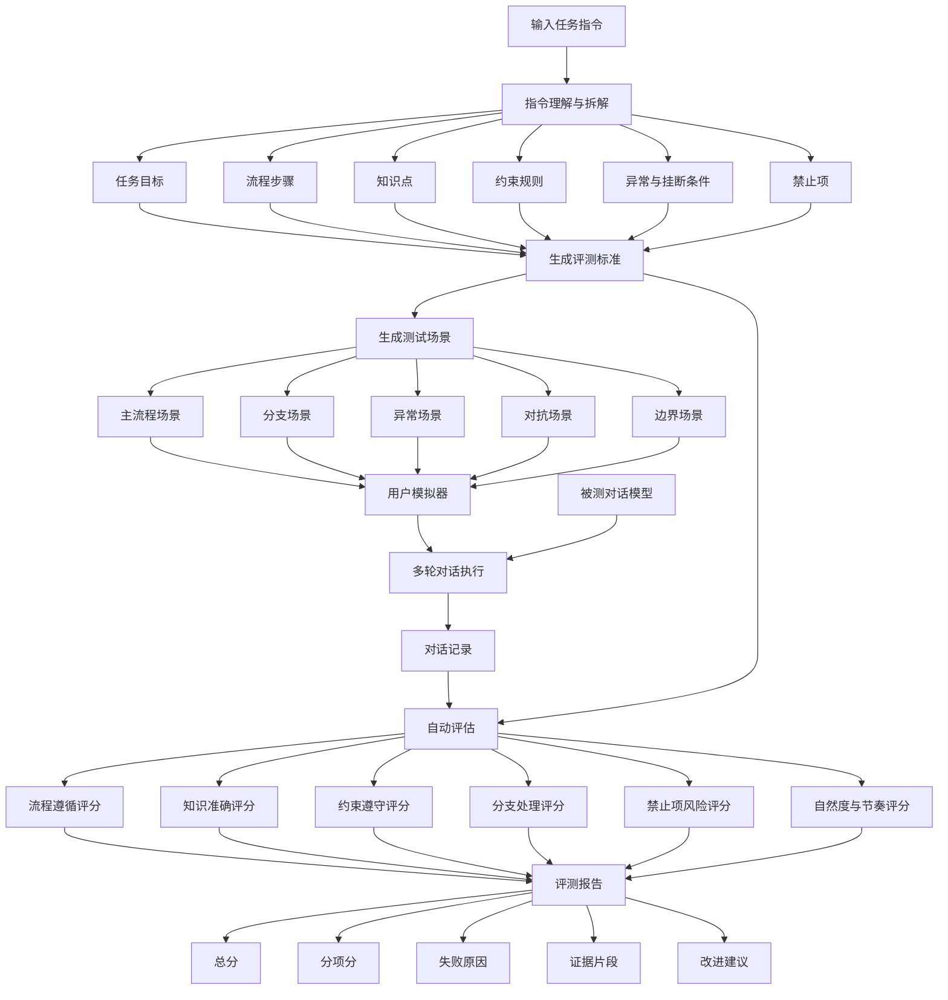

```mermaid
flowchart TD
    A["输入任务指令"] --> B["指令理解与拆解"]

    B --> B1["任务目标"]
    B --> B2["流程步骤"]
    B --> B3["知识点"]
    B --> B4["约束规则"]
    B --> B5["异常与挂断条件"]
    B --> B6["禁止项"]

    B1 --> C["生成评测标准"]
    B2 --> C
    B3 --> C
    B4 --> C
    B5 --> C
    B6 --> C

    C --> D["生成测试场景"]
    D --> D1["主流程场景"]
    D --> D2["分支场景"]
    D --> D3["异常场景"]
    D --> D4["对抗场景"]
    D --> D5["边界场景"]

    D1 --> E["用户模拟器"]
    D2 --> E
    D3 --> E
    D4 --> E
    D5 --> E

    E --> F["多轮对话执行"]
    G["被测对话模型"] --> F
    F --> H["对话记录"]

    H --> I["自动评估"]
    C --> I

    I --> I1["流程遵循评分"]
    I --> I2["知识准确评分"]
    I --> I3["约束遵守评分"]
    I --> I4["分支处理评分"]
    I --> I5["禁止项风险评分"]
    I --> I6["自然度与节奏评分"]

    I1 --> J["评测报告"]
    I2 --> J
    I3 --> J
    I4 --> J
    I5 --> J
    I6 --> J

    J --> K["总分"]
    J --> L["分项分"]
    J --> M["失败原因"]
    J --> N["证据片段"]
    J --> O["改进建议"]
```